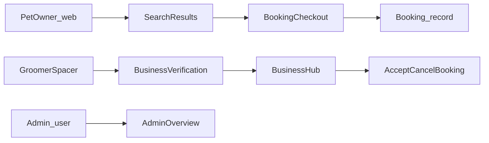

# Fursgo — Project Flow

## Product

Pet grooming marketplace (UK-oriented):

- **Pet owners** (`web` guard / `User`) search and book groomers or spaces, manage pets/profile/settings.
- **Providers** (`groomer_spacer` guard / `GroomerSpacerProfile`) complete business verification, then run **Business Hub** + **Marketing Hub**.
- **Admins** (`User` with `user_type=admin`) use `/admin`.

## Stack & run

| Item        | Detail                                                          |
| ----------- | --------------------------------------------------------------- |
| Framework   | Laravel 12, PHP ^8.2                                            |
| UI          | Livewire Volt + Flux; Blade under `resources/views/`            |
| PDF         | `barryvdh/laravel-dompdf`                                       |
| Tests       | Pest                                                            |
| Run         | `composer run dev` → `php artisan serve --no-reload`            |
| Local reset | Non-prod only: `GET /seed` (migrate:fresh --seed), `GET /clear` |

## Directory map

| Path                          | Purpose                                                                               |
| ----------------------------- | ------------------------------------------------------------------------------------- |
| `routes/web.php`              | Public + authenticated app routes                                                     |
| `routes/auth.php`             | Login/signup/verification (owner + groomer/space)                                     |
| `routes/admin.php`            | `/admin` Volt routes                                                                  |
| `app/Models/`                 | Eloquent models                                                                       |
| `app/Http/Controllers/`       | Bookings, pets, search, PDFs, exports                                                 |
| `app/Http/Middleware/`        | Auth guards, business page shells, login session tracking                             |
| `app/Support/`                | `VoltPage`, `BusinessHubNav`, `MarketingHubNav`, `BusinessPageShell`, decline reasons |
| `app/Livewire/`               | Sparse (e.g. `Actions/Logout`); most UI is Volt                                       |
| `resources/views/livewire/`   | Volt page components (primary UI)                                                     |
| `resources/views/components/` | Blade UI (business-hub, admin, shared)                                                |
| `database/migrations/`        | Schema                                                                                |
| `database/seeders/`           | Including `DevUserSeeder`                                                             |
| `public/`                     | CSS, images, fonts, icons                                                             |

Pages render via `app/Support/VoltPage.php` → Volt name maps to `resources/views/livewire/{dot.path}.blade.php`.

## Auth & roles

**Guards** (`config/auth.php`):

| Guard            | Provider / model       | Use                        |
| ---------------- | ---------------------- | -------------------------- |
| `web`            | `User`                 | Pet owners (+ admin users) |
| `groomer_spacer` | `GroomerSpacerProfile` | Groomers / space owners    |

**Middleware aliases** (`bootstrap/app.php`):

- `auth.admin` → `EnsureAdminAuthenticated`
- `auth.groomer_spacer` → `EnsureGroomerSpacerAuthenticated`
- `auth.web_or_groomer_spacer` → `EnsureWebOrGroomerSpacerAuthenticated`
- `business.shell.web` / `business.shell.business-hub` → header shell variants

**Web append middleware:** `TrackAccountLoginSession`, `ApplyBusinessPageShellFromRequest`.

**Role signals:**

- Admin: `User::isAdmin()` → `user_type === 'admin'`; also `user_status === 'active'`.
- Provider types on profile: `GroomerSpacerProfile.user_type` (e.g. groomer vs `space`).
- DB table / FK spelling: `goormer_spacer_profiles`, often `goormer_spacer_id`.

## Route map (by actor)

### Public

| Route                                      | Volt / view                                                                            | Name                                    |
| ------------------------------------------ | -------------------------------------------------------------------------------------- | --------------------------------------- |
| `/`                                        | `home`                                                                                 | `home`                                  |
| `/business-landing-page`                   | static blade                                                                           | `business-landing-page`                 |
| `/business-homepage-groomer-space-owner`   | `business.homepage` or hub shell variant                                               | `business-homepage-groomer-space-owner` |
| `/search-results`                          | `search.results`                                                                       | `search-results`                        |
| `/support-and-assistance/search`           | `help.search`                                                                          | `search`                                |
| `/support-and-assistance/help-and-support` | legacy static help                                                                     | `help-and-support`                      |
| Checkout shells                            | `checkout.booking-groomer`, `checkout.booking-space`, `checkout.booking-groomer-space` | `checkout.*`                            |
| Groomer/space unavailability URLs          | `groomer.unavailability` / `space.unavailability`                                      | various                                 |
| Overlay demos                              | cookies / rating blade files                                                           | cookies*, rating*                       |

### Pet owner (`web` or web-or-groomer middleware)

| Route                                                | Notes                                                   |
| ---------------------------------------------------- | ------------------------------------------------------- |
| `/login`, `/signup` (+ `login-signup/*` aliases)     | Volt auth                                               |
| `/login-signup/setup_owner_account*`                 | Owner onboarding                                        |
| `/booking-groomer`                                   | Booking UI                                              |
| `/my-account/pet-owner-profile`, `/settings/profile` | Profile                                                 |
| `/account-settings` (+ download-data)                | Settings; redirect from `/account-and-setting/settings` |
| `/pet-details` GET/POST                              | Volt manager + `PetDetailController@store`              |
| `/bookings` CRUD + accept/cancel                     | `BookingController`                                     |

### Provider (`groomer_spacer`)

| Route                                                 | Notes                                                                                   |
| ----------------------------------------------------- | --------------------------------------------------------------------------------------- |
| `/login-groomer-space`, `/signup-groomer-space`       | Always reachable (not behind `guest`; already-authed groomer redirects in page `mount`) |
| `/business-verification` (+ PDF/private files)        | Onboarding                                                                              |
| `/business-hub`                                       | Main provider app (session nav)                                                         |
| `POST /business-hub/nav`, `POST /business-hub/switch` | Nav persist / multi-profile switch (same email)                                         |
| `/marketing-hub` + `POST /marketing-hub/nav`          | Marketing                                                                               |
| Invoice PDF/HTML                                      | `business-hub/bookings/{booking}/invoice.pdf`                                           |

### Admin

| Route          | Notes                                    |
| -------------- | ---------------------------------------- |
| `/admin/login` | Volt `admin.auth.login`                  |
| `/admin`       | Volt `admin.overview` (tabbed Alpine UI) |

Auth routes: `routes/auth.php`. Admin: `routes/admin.php`.

## Core entities

| Model                                                               | Role                                                                                                               |
| ------------------------------------------------------------------- | ------------------------------------------------------------------------------------------------------------------ |
| `User`                                                              | Pet owner / admin; pets, bookings as owner                                                                         |
| `GroomerSpacerProfile`                                              | Provider account (JSON business profiles, payout, verification flags)                                              |
| `Groomer` / `Space`                                                 | Provider-side profiles linked historically to users                                                                |
| `Booking`                                                           | `pet_owner_id`, `goormer_spacer_id`, date/time, service, amount, status, add-ons, staff, refunds, marketing fields |
| `PetDetail` + `PetMedicationDetail`                                 | Owner pets; M2M `booking_pet`                                                                                      |
| `Service`, `AddOn`, `ServiceArea`, `ServicePolicy`, `PetPreference` | Provider catalog / policies                                                                                        |
| `Staff`                                                             | Provider staff calendar                                                                                            |
| `Payment`, `PromoCode`, `PromoCodeUsage`                            | Money / discounts                                                                                                  |
| `Review`                                                            | Post-booking ratings                                                                                               |
| `SupportTicket` (+ attachments), `FaqCategory`, `FaqArticle`        | Help                                                                                                               |
| `AccountSetting`, `AccountLoginSession`, `AccountBlock`             | Account security / prefs                                                                                           |

**Booking statuses:** `pending` → `confirmed` → `completed`; or `cancelled` (`cancelled_by`, `cancellation_reason`, refund fields).

## Main flows

**Owner:** signup → optional `login-signup` owner setup → add pets (`/pet-details`) → search → booking/checkout → `/bookings` lifecycle.

**Provider:** signup-groomer-space → business-verification (ID, business profile, legal, status) → `/business-hub` (services, availability, bookings, clients, earnings, settings) → optional `/marketing-hub`.

**Booking ops:** create via UI / `BookingController@store`; provider accept/cancel patches; invoice PDF from hub.

## Business Hub / Marketing Hub

Single Volt pages; section state in session (not separate routes).

**BusinessHubNav** (`app/Support/BusinessHubNav.php`):

- Sections: `business-hub`, `bookings`, `availability`, `manage-availability`, `services`, `clients`, `earnings`, `settings`
- Booking filters: `pending` | `confirmed` | `completed` | `cancelled`
- Overview Pending Requests “View details” opens `pending-request-modal` (Livewire `detailsBookingId`)
- Avatar placeholders (no photo / broken image): initials via `App\Support\BusinessHubAvatar` / `x-business-hub.common.avatar` + `window.bhAvatarFallback`; text `#FDFDFD` Lato 800; bg groomer `#FFC97A`, space `#FFA899` (`--bh-avatar-bg` / `--bh-avatar-ring`). Photo available: white circle ring with same accent stroke.
- Service menus: `services`, `add-ons`, `pet-preferences`, `service-area`
- Earnings menus: `overview`, `transactions`, `pay-outs`, `invoices`
- Settings menus: `general`, `business-details`, `service-policies`

**MarketingHubNav:** parallel session nav for marketing hub Volt.

**Shells:** `SetBusinessPageWebShell` vs `SetBusinessPageBusinessHubShell` / `BusinessPageShell::resolveComponent(...)` for shared pages with dual chrome.

Volt entry: `resources/views/livewire/business-hub.blade.php`, nested under `livewire/business-hub/**`.

## Admin

- Login: `/admin/login`; middleware `auth.admin`.
- Overview: `/admin` with Alpine tabs — components under `resources/views/components/admin/` and `resources/views/admin/tabs/`.
- Business provider detail tabs: Overview, Profile (public profile / gallery / business details / notes / activity + Services · Policies · Reviews subnav; dual Groomer/Space Host via sidebar `viewAs` — space subnav active `#FFA899`, active status pills `#EAF3DE`/`#A7C569`), Activity, Account, Compliance, Support (ticket list → detail with submission / limited thread / linked states: populated · empty · na · suggested / shared admin notes / details+activity; no modals; sidebar stays default provider actions); Bookings / Payouts still placeholders.
- Pet owner detail tabs: overview, pets, bookings, payments (list + detail by status), support (ticket list → detail with submission / linked records + Add link / Mark as resolved / Open dispute (+ success) / Merge / Reassign / Close ticket modals / thread / notes / details+activity; sidebar switches list actions ↔ ticket actions), referrals, activity — under `resources/views/components/admin/customer/`.

## Codebase notes

- Primary UI lives in Volt under `resources/views/livewire/`.
- `web.php` keeps underscore/hyphen URL aliases and redirects for legacy parity.
- Help & Support serves legacy static views; older Volt help components remain (see comments in `web.php`).
- GET requests to Livewire `/update` paths redirect to referer (`bootstrap/app.php` exception handler).
- Profile switch (`business-hub/switch`) only allows profiles with the same email.
- Controllers: `BookingController`, `PetDetailController`, `SearchController`, `BookingInvoicePdfController`, `AccountDataExportController`, `LegalAgreementsPdfController`, `GroomerSpacerPrivateFileController`.
